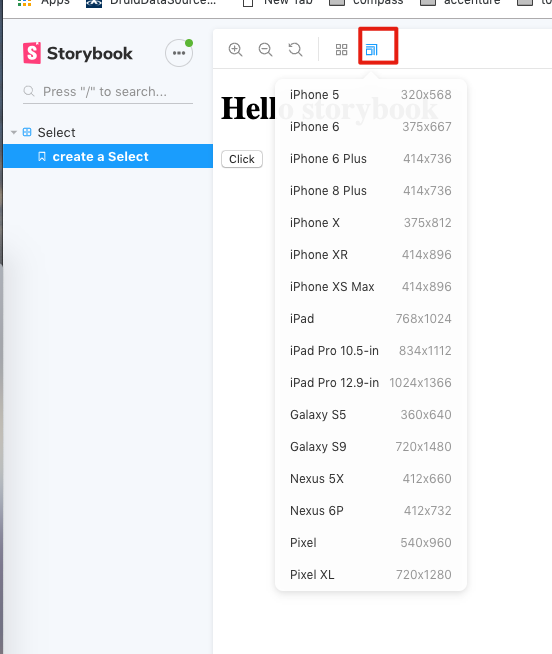

JavaScript React "storybook" "addon-viewport" Demo
================================================

'addon-viewport'可以让我们在不同的屏幕大小（比如手机）查看某个组件的效果。

注意：图标在上面而不是下面，有点不显眼。



```
npm install
npm run storybook
```
